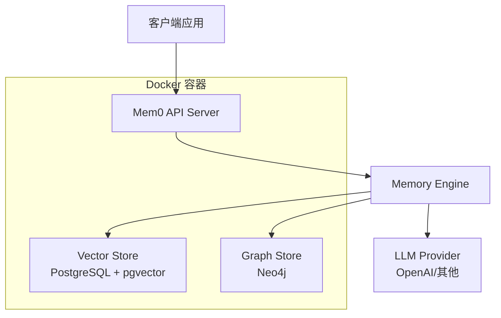

# Mem0 - 基于Docker的智能记忆层

<p align="center">
  <a href="https://github.com/mem0ai/mem0">
    
  </a>
</p>

<p align="center">
  <strong>基于 Mem0 的 Docker 化部署方案 - 为 AI 助手和智能体提供可扩展的长期记忆能力</strong>
</p>

<p align="center">
  <a href="#快速开始">快速开始</a> •
  <a href="#功能特性">功能特性</a> •
  <a href="#部署指南">部署指南</a> •
  <a href="#api-文档">API 文档</a> •
  <a href="#示例">示例</a>
</p>

---

## 📋 目录

- [项目简介](#项目简介)
- [功能特性](#功能特性)
- [系统架构](#系统架构)
- [快速开始](#快速开始)
- [部署指南](#部署指南)
- [API 文档](#api-文档)
- [配置说明](#配置说明)
- [示例代码](#示例代码)
- [故障排除](#故障排除)
- [贡献指南](#贡献指南)
- [许可证](#许可证)

## 项目简介

本项目是基于 [Mem0](https://mem0.ai) 的 Docker 化改造版本，提供了完整的容器化部署方案。Mem0 是一个智能记忆层，能够为 AI 助手和智能体提供个性化的交互体验，通过记住用户偏好、适应个人需求并持续学习来提升AI系统的能力。

### 🎯 主要改进

- **🐳 Docker 化部署**: 完整的 Docker Compose 配置，一键启动所有服务
- **🔧 中文化支持**: 提供中文文档和配置说明
- **🚀 生产就绪**: 包含 PostgreSQL + Neo4j 的完整技术栈
- **🔐 安全认证**: 内置 API Key 认证机制
- **📊 数据持久化**: 完整的数据存储和备份方案

## 功能特性

### 核心能力
- **🧠 多层级记忆**: 无缝保留用户、会话和智能体状态，实现自适应个性化
- **🔍 智能搜索**: 基于语义的记忆检索和匹配
- **📈 持续学习**: 从交互中不断学习和优化
- **🔄 实时更新**: 支持记忆的实时添加、更新和删除

### 应用场景
- **🤖 AI 助手**: 提供一致的、上下文丰富的对话体验
- **💬 客服系统**: 记住过往工单和用户历史，提供个性化帮助
- **🏥 医疗健康**: 跟踪患者偏好和历史，提供个性化护理
- **🎮 生产力工具**: 基于用户行为的自适应工作流程和环境

## 系统架构



## 快速开始

### 前置要求

- Docker 20.10+
- Docker Compose 2.0+
- 至少 4GB 可用内存
- OpenAI API Key 或其他兼容的 LLM 服务

### 一键启动

1. **克隆项目**
   ```bash
   git clone <your-repo-url>
   cd mem0
   ```

2. **配置环境变量**
   ```bash
   cp .env.example .env
   # 编辑 .env 文件，设置必要的环境变量
   ```

3. **启动服务**
   ```bash
   docker-compose up -d
   ```

4. **验证部署**
   ```bash
   # 检查服务状态
   docker-compose ps
   
   # 查看 API 文档
   curl http://localhost:8000/docs
   ```

## 部署指南

### 环境变量配置

创建 `.env` 文件并配置以下变量：

```env
# API 认证
API_KEY=your_secure_api_key_here

# OpenAI 配置
OPENAI_API_KEY=your_openai_api_key
OPENAI_BASE_URL=https://api.openai.com/v1

# 数据库配置
POSTGRES_DB=mem0_db
POSTGRES_USER=postgres
POSTGRES_PASSWORD=your_postgres_password
POSTGRES_COLLECTION_NAME=memories

# Neo4j 配置
NEO4J_USERNAME=neo4j
NEO4J_PASSWORD=your_neo4j_password

# 其他配置
HISTORY_DB_PATH=/app/history/history.db
```

### 服务配置详解

#### 1. Mem0 API 服务
- **端口**: 8000
- **功能**: 提供 RESTful API 接口
- **依赖**: PostgreSQL, Neo4j

#### 2. PostgreSQL (向量数据库)
- **端口**: 5432
- **功能**: 存储向量化的记忆数据
- **扩展**: pgvector 用于向量相似度搜索

#### 3. Neo4j (图数据库)
- **端口**: 7474 (HTTP), 7687 (Bolt)
- **功能**: 存储记忆之间的关系图谱
- **插件**: APOC 用于图数据处理

### 生产环境部署

1. **资源规划**
   ```yaml
   # 推荐配置
   CPU: 4 cores
   Memory: 8GB+
   Storage: 50GB+ SSD
   ```

2. **安全配置**
   ```bash
   # 设置强密码
   # 配置防火墙规则
   # 启用 HTTPS
   # 定期备份数据
   ```

3. **监控配置**
   ```bash
   # 添加健康检查
   # 配置日志收集
   # 设置告警规则
   ```

## API 文档

### 基础认证

所有 API 请求都需要在 Header 中包含 API Key：

```bash
Authorization: Bearer your_api_key_here
```

### 核心 API 端点

#### 1. 添加记忆
```http
POST /memories/
Content-Type: application/json

{
  "messages": [
    {"role": "user", "content": "我喜欢喝咖啡"},
    {"role": "assistant", "content": "好的，我记住了您喜欢咖啡"}
  ],
  "user_id": "user_123",
  "metadata": {"source": "chat"}
}
```

#### 2. 搜索记忆
```http
POST /search/
Content-Type: application/json

{
  "query": "用户的饮品偏好",
  "user_id": "user_123",
  "limit": 5
}
```

#### 3. 获取记忆
```http
GET /memories/?user_id=user_123
```

#### 4. 更新记忆
```http
PUT /memories/{memory_id}
Content-Type: application/json

{
  "content": "更新后的记忆内容"
}
```

#### 5. 删除记忆
```http
DELETE /memories/{memory_id}
```

### API 响应格式

```json
{
  "success": true,
  "data": {
    "memory_id": "mem_123",
    "content": "记忆内容",
    "created_at": "2024-01-01T00:00:00Z"
  },
  "message": "操作成功"
}
```

## 配置说明

### Docker Compose 配置

```yaml
# docker-compose.yml 主要配置项说明
services:
  mem0:
    # 使用自定义镜像
    image: registry.cn-shenzhen.aliyuncs.com/tokengo/mem0
    # 环境变量配置
    environment:
      - OPENAI_BASE_URL=https://api.token-ai.cn/v1
      - NEO4J_URI=bolt://neo4j:7687
    # 数据卷挂载
    volumes:
      - ./history:/app/history
```

### 自定义配置

可以通过修改 `server/main.py` 中的 `DEFAULT_CONFIG` 来自定义配置：

```python
DEFAULT_CONFIG = {
    "version": "v1.1",
    "vector_store": {
        "provider": "pgvector",
        "config": {
            "host": "postgres",
            "port": 5432,
            # ... 其他配置
        }
    },
    "llm": {
        "provider": "openai",
        "config": {
            "model": "gpt-4o",
            "temperature": 0.2
        }
    }
}
```

## 示例代码

### Python 客户端示例

```python
import requests
import json

class Mem0Client:
    def __init__(self, base_url="http://localhost:8000", api_key=None):
        self.base_url = base_url
        self.headers = {
            "Content-Type": "application/json",
            "Authorization": f"Bearer {api_key}" if api_key else ""
        }
    
    def add_memory(self, messages, user_id, metadata=None):
        """添加新记忆"""
        data = {
            "messages": messages,
            "user_id": user_id,
            "metadata": metadata or {}
        }
        response = requests.post(
            f"{self.base_url}/memories/",
            headers=self.headers,
            json=data
        )
        return response.json()
    
    def search_memories(self, query, user_id, limit=5):
        """搜索记忆"""
        data = {
            "query": query,
            "user_id": user_id,
            "limit": limit
        }
        response = requests.post(
            f"{self.base_url}/search/",
            headers=self.headers,
            json=data
        )
        return response.json()

# 使用示例
client = Mem0Client(api_key="your_api_key")

# 添加记忆
messages = [
    {"role": "user", "content": "我明天要参加重要会议"},
    {"role": "assistant", "content": "我会帮您记住这个重要会议"}
]
result = client.add_memory(messages, user_id="user_123")
print(f"记忆已添加: {result}")

# 搜索记忆
memories = client.search_memories("会议", user_id="user_123")
print(f"找到相关记忆: {memories}")
```

### 聊天机器人集成示例

```python
from openai import OpenAI
import requests

class ChatBotWithMemory:
    def __init__(self, openai_api_key, mem0_api_key, mem0_base_url="http://localhost:8000"):
        self.openai_client = OpenAI(api_key=openai_api_key)
        self.mem0_client = Mem0Client(mem0_base_url, mem0_api_key)
    
    def chat(self, message, user_id):
        # 搜索相关记忆
        memories = self.mem0_client.search_memories(message, user_id, limit=3)
        memory_context = "\n".join([
            f"- {mem['content']}" for mem in memories.get('results', [])
        ])
        
        # 构建提示词
        system_prompt = f"""你是一个有记忆的AI助手。
        基于以下用户记忆来回答问题：
        {memory_context}
        
        请提供个性化的回答。"""
        
        # 调用 OpenAI
        response = self.openai_client.chat.completions.create(
            model="gpt-4o-mini",
            messages=[
                {"role": "system", "content": system_prompt},
                {"role": "user", "content": message}
            ]
        )
        
        assistant_response = response.choices[0].message.content
        
        # 保存新的对话记忆
        conversation = [
            {"role": "user", "content": message},
            {"role": "assistant", "content": assistant_response}
        ]
        self.mem0_client.add_memory(conversation, user_id)
        
        return assistant_response

# 使用示例
bot = ChatBotWithMemory(
    openai_api_key="your_openai_key",
    mem0_api_key="your_mem0_key"
)

response = bot.chat("今天天气怎么样？", user_id="user_123")
print(response)
```

## 故障排除

### 常见问题

1. **服务启动失败**
   ```bash
   # 检查端口占用
   netstat -tulpn | grep :8000
   
   # 检查 Docker 日志
   docker-compose logs mem0
   ```

2. **数据库连接失败**
   ```bash
   # 检查数据库状态
   docker-compose ps postgres neo4j
   
   # 重启数据库服务
   docker-compose restart postgres neo4j
   ```

3. **API 认证失败**
   ```bash
   # 检查环境变量
   docker-compose exec mem0 env | grep API_KEY
   ```

### 性能优化

1. **数据库优化**
   ```sql
   -- PostgreSQL 索引优化
   CREATE INDEX IF NOT EXISTS idx_memories_user_id ON memories(user_id);
   CREATE INDEX IF NOT EXISTS idx_memories_created_at ON memories(created_at);
   ```

2. **内存配置**
   ```yaml
   # docker-compose.yml
   services:
     postgres:
       environment:
         - POSTGRES_SHARED_BUFFERS=256MB
         - POSTGRES_EFFECTIVE_CACHE_SIZE=1GB
   ```

### 日志管理

```bash
# 查看实时日志
docker-compose logs -f mem0

# 查看特定时间范围的日志
docker-compose logs --since="2024-01-01" --until="2024-01-02" mem0

# 导出日志
docker-compose logs mem0 > mem0.log
```

## 贡献指南

我们欢迎社区贡献！请遵循以下步骤：

1. Fork 本仓库
2. 创建特性分支 (`git checkout -b feature/AmazingFeature`)
3. 提交更改 (`git commit -m 'Add some AmazingFeature'`)
4. 推送到分支 (`git push origin feature/AmazingFeature`)
5. 创建 Pull Request

### 开发环境设置

```bash
# 安装开发依赖
pip install -r requirements-dev.txt

# 运行测试
pytest tests/

# 代码格式化
black .
flake8 .
```

## 许可证

本项目采用 Apache 2.0 许可证 - 详见 [LICENSE](LICENSE) 文件。

## 致谢

- 感谢 [Mem0](https://mem0.ai) 团队提供的优秀基础框架
- 感谢所有贡献者的努力和支持

---

<p align="center">
  <strong>🌟 如果这个项目对您有帮助，请给我们一个 Star！</strong>
</p>